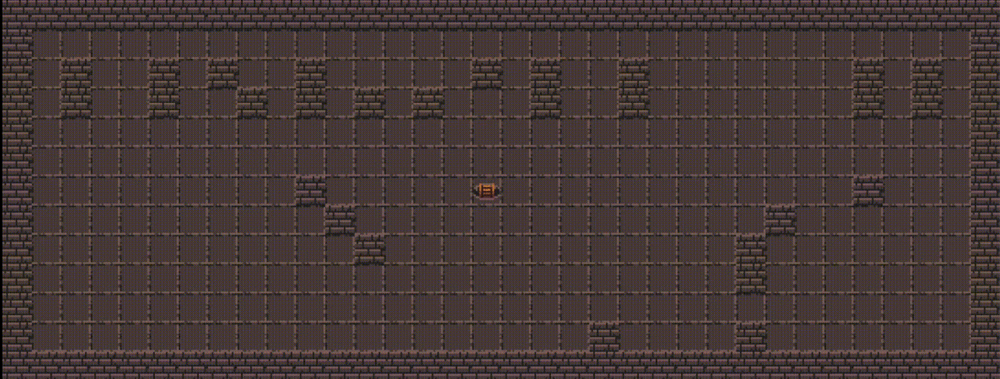

# 42-so-long



This project is a very small 2D game. It is built to make you work with textures, sprites. And some very basic gameplay elements.

This project’s objectives are similar to all this first year’s objectives: Rigor, use of C, use of basic algorithms, information research etc.

As a graphic design project, so long will enable you to improve your skills in these
areas: windows, colors, events, textures, etc

Made with PDF version 1

## Resources

[minilibx docs](https://harm-smits.github.io/42docs/libs/minilibx)

[minilib linux](https://github.com/42Paris/minilibx-linux)

[minilibx examples](https://github.com/taelee42/mlx_example)

[notion](https://bumpy-truffle-c97.notion.site/SoLong-13550c956d2f4d288b6a73a97ee7bccb)

[pixel art/sprite resizer online](https://lospec.com/pixel-art-scaler/)

## Useful commands

`LINUX_FLAGS = -L $(LIBS)minilibx-linux -lmlx -lm -lX11 -lXext`

`set -x DISPLAY (grep nameserver /etc/resolv.conf | sed 's/nameserver //')":0"`

Simple command to run with minilibx without make file

`gcc -Wall -Wextra -Werror -I mlx -L mlx -lmlx -lXext -lX11 -lm -lz ./src/main.c ./mlx/libmlx.a && ./a.out`

Convert png/jpg to xpm

```sh
apt-get install imagemagick
convert image.jpg image.xpm
```

If you use fish instead of bash configure your display like:

```sh
echo "set -x DISPLAY localhost:0.0" >> ~/.config/fish/config.fish
To have the configuration changes take effect, restart fish, or run:
. ~/.config/fish/config.fish
```
